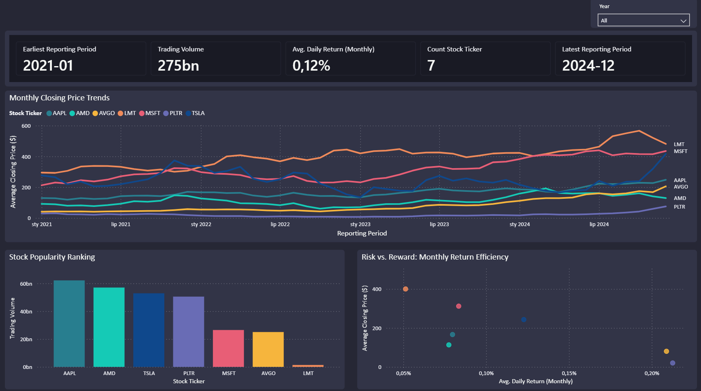

# Stock Market Insights (2021–2025)

## 📊 Project Overview
End-to-end data pipeline for analyzing stock market trends across 7 companies (2021–2025).
Built to demonstrate a production-style analytics engineering workflow using modern data stack tools.

**Companies analyzed:** TSLA, AAPL, MSFT, PLTR, AMD, LMT, AVGO

## 🧱 Architecture  
yfinance API → Python ETL → Azure Blob Storage → Snowflake → dbt → Power BI


| Layer | Tool | Purpose |
|---|---|---|
| Extraction | Python + yfinance | Pull historical OHLCV data |
| Storage | Azure Blob Storage | Raw data landing zone (Bronze) |
| Warehouse | Snowflake | Cloud data warehouse |
| Transformation | dbt Core | Staging + mart models |
| Visualization | Power BI | Interactive dashboard |

## ⚙️ Tech Stack
Python · SQL · dbt Core · Snowflake · Azure Blob Storage · Power BI · Git

## 📁 Project Structure

stock-market-project/
├── etl/
│   ├── extract_stock_data.py   # Extract & transform via yfinance
│   └── upload_to_blob.py       # Upload CSV to Azure Blob
├── stock_market/               # dbt project
│   └── models/
│       ├── staging/            # stg_stock_prices (view)
│       └── mart/               # mart_stock_prices (table)
└── README.md


## 📈 dbt Models
**Staging** — `stg_stock_prices`
- Cleans and validates raw data from Snowflake RAW schema
- Filters nulls, standardizes column names

**Mart** — `mart_stock_prices`
- Aggregates monthly metrics per ticker
- Metrics: avg/min/max close price, avg daily return, total volume, 7-day moving average

## 📊 Dashboard (Power BI)

- Monthly closing price trends per ticker
- Stock popularity ranking by trading volume
- Risk vs. Reward scatter plot (avg daily return vs. avg price)
- KPIs: earliest/latest reporting period, total volume, avg daily return, ticker count

## 🔑 Key Results
- 7 tickers × 4 years = ~7,000 daily records processed
- AVGO and PLTR highest avg daily return (~0.20%/day)
- LMT lowest volatility — defensive stock behavior confirmed
- Full pipeline runs end-to-end in under 60 seconds

## 🚀 How to Run
```bash
# 1. Install dependencies
pip install -r requirements.txt

# 2. Set environment variables
cp .env.example .env  # add your Azure connection string

# 3. Run ETL
python etl/extract_stock_data.py
python etl/upload_to_blob.py

# 4. Run dbt
cd stock_market
dbt run
```

